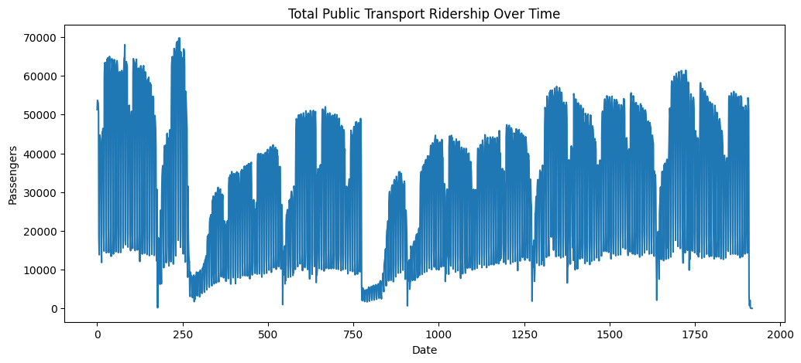
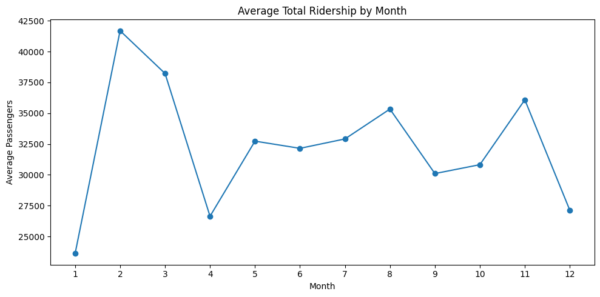
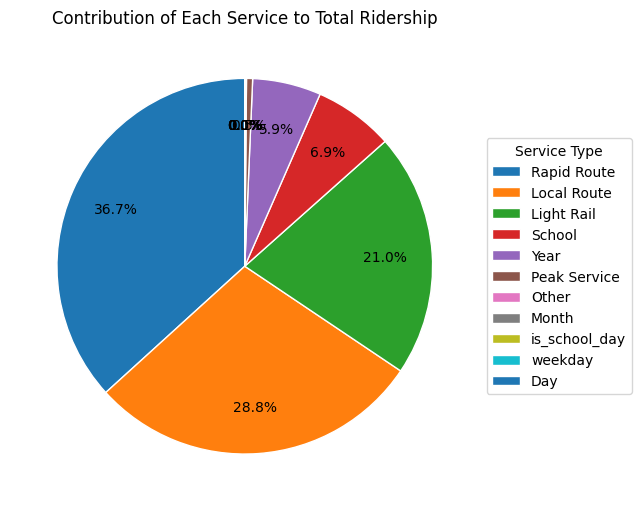

## Dataset Title: Daily Public Transport Ridership by Service Type
  - This dataset records daily passenger journeys across multiple public transport services including Local Routes, Rapid Routes, Light Rail, School Services, Peak Services, and Other categories.
  - It provides a time-series view of ridership trends and service-level demand patterns over several years.
  - The dataset is suitable for trend analysis, seasonality detection, forecasting, and studying the impact of external disruptions such as COVID-19.

## Overview of EDA Process:
  - The data was first cleaned and organized to make sure dates and values were correct.
  - Important features like total ridership and day-based details were created to make analysis easier.
  - Graphs and summaries were then used to understand patterns, trends, and unusual changes in usage.

## Key Insights
### 1. Total Ridership Shows Strong Recovery After COVID — But Has Not Surpassed Pre-COVID Peak
   - Ridership dropped sharply during 2020–2021 due to the pandemic.
   - Usage has been steadily improving since 2022.
   - Current levels still remain below what they were before COVID.
   - Growth is positive, but planning should remain cautious for now.

**Graph:**  

### 2. February Has the Highest Demand
  - February consistently peaks, suggesting that operational staffing and fleet allocation should be increased during this month.
  - Peak month at ~41,700 passengers/day.
  - All major services spike together.
  - January and December are weakest.

**Graph:** 

### 3. The System Is Strictly Weekday-Driven, With Severe Weekend Drop
  - Tuesday, Wednesday, and Thursday record the highest ridership.
  - Sunday is the weakest travel day system-wide.
  - Peak and School services nearly disappear on weekends.
  - This network is optimized for commuting, not leisure travel.
  - Weekend demand is structurally low, not random.

### 4. Rapid Route is the Primary Driver; “Other” Is Operational Noise
  - Service contributions:
     - Rapid Route = 36.7%
     - Local Route = 28.8%
     - Light Rail = 21.0%
  - “Other” contributes almost nothing to system volume.
  - Even during spikes, “Other” never alters system-wide totals.
  - Forecasting should focus on Rapid, Local, and Light Rail.

**Graph:**  

### 5. Service Behavior Varies Significantly Across the Network
- Rapid & Local:
  - Strong weekly cycles
  - Predictable weekday peaks
- School:
  - Term-based activity with holiday shutdowns
- Light Rail:
  - Smooth long-term growth
  - Moderate seasonality
- “Other”:
  - No clear seasonality
  - Sudden, random spikes (event-driven)

# Conclusion
The network is commuter-driven, seasonally predictable, and still recovering from COVID impact.  
Rapid Route dominates ridership, while “Other” represents external events, not daily travel.  
Each service must be modeled and planned independently.

---
# Public Transport Ridership Forecasting

### Overview: >
  Forecasts daily passenger demand using SARIMA time-series modeling to
  capture seasonality, trend, and demand patterns across transport services.

### Model:
  - Name: SARIMA
  - implementation: SARIMAX (no exogenous variables used)
  - seasonality: weekly (7 days)
  - structure: SARIMA(p, d, q) x (P, D, Q, 7)
  - modeling_style: service-wise independent models

### Why_sarima:
  - Handles seasonality directly (weekly travel pattern)
  - Models time dependency and autocorrelation
  - Works well for structured time-series data
  - Requires less data than deep learning models
  - Provides interpretable parameters
  - Efficient to train on CPU
  - Ideal for short-term forecasting tasks
  - Supports trend and seasonal differencing

### Data_processing:
  - Parsed date column and set datetime index
  - Enforced daily frequency
  - Filtered numeric columns
  - Applied time-based interpolation
  - Forward and backward filled missing values
  - Computed total ridership series

### Parameter_selection:
  - method: AIC-based grid search
  - range:
    - p_d_q: [0, 1]
    - P_D_Q: [0, 1]
  - seasonal_period: 7

### Forecasting_workflow:
  - steps:
    - Train on historical data
    - Reserve last 90 days for validation
    - Predict on test data
    - Generate next 7-day forecast
    - Clip negative predictions to zero

### Forecasted_values:

#### SERVICE: Local Route
Next 7 days forecast:
- 2024-07-02    15975.85
- 2024-07-03    16154.34
- 2024-07-04    15750.15
- 2024-07-05    14934.24
- 2024-07-06     4623.30
- 2024-07-07     2814.86
- 2024-07-08    13437.15

#### SERVICE: Light Rail
Next 7 days forecast:
- 2024-07-02    10720.97
- 2024-07-03    10682.42
- 2024-07-04    10183.96
- 2024-07-05     9891.58
- 2024-07-06     5932.76
- 2024-07-07     4275.43
- 2024-07-08     8785.53

#### SERVICE: Peak Service
- Next 7 days forecast:
- 2024-07-02    367.35
- 2024-07-03    362.95
- 2024-07-04    313.82
- 2024-07-05    243.04
- 2024-07-06      0.00
- 2024-07-07      0.00
- 2024-07-08    287.18

#### SERVICE: Rapid Route
Next 7 days forecast:
- 2024-07-02    19394.24
- 2024-07-03    19202.86
- 2024-07-04    18558.05
- 2024-07-05    17630.72
- 2024-07-06     8397.99
- 2024-07-07     6496.22
- 2024-07-08    15933.76
  
#### SERVICE: School
Next 7 days forecast:
- 2024-07-02    3654.72
- 2024-07-03    3749.78
- 2024-07-04    3731.85
- 2024-07-05    3552.38
- 2024-07-06     171.02
- 2024-07-07     184.77
- 2024-07-08    3202.42

#### SERVICE: Other
Next 7 days forecast:
- 2024-07-02    77.62
- 2024-07-03    77.45
- 2024-07-04    78.74
- 2024-07-05    71.16
- 2024-07-06    19.70
- 2024-07-07    18.83
- 2024-07-08    57.76

### Evaluation_metrics:
  - Primary:
    - MAE
    - RMSE
  - Secondary:
    - MAPE (informational due to zero values)

### Conclusion: >
  The SARIMA model effectively captures weekly seasonality and short-term
  demand behavior. It performs best for stable services and provides reliable
  short-horizon forecasts, while high-volume routes require further tuning.

