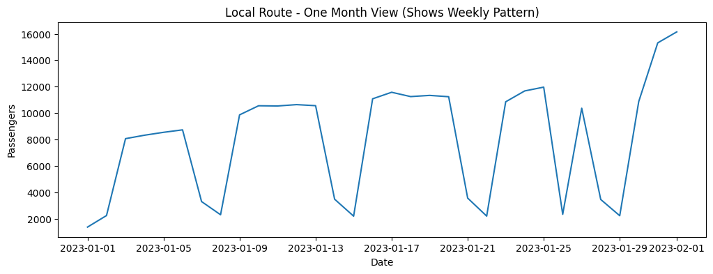

# Public Transport Ridership Analysis — EDA

## Introduction
This project analyzes daily public transport usage across Local, Rapid, Light Rail, School, Peak, and Other services.  
The objective is to identify growth patterns, seasonality, service behavior, and COVID impact to support planning and forecasting.

The dataset spans multiple years, covering pre-COVID, COVID, and recovery phases.

---

# Key Insights

---
## 1. Total Ridership Shows Strong Recovery After COVID — But Has Not Surpassed Pre-COVID Peak
### 🔹 Insight Summary
- The time-series graph shows a major collapse in ridership during 2020–2021.
- Post-2022, ridership steadily rises, indicating recovery.
- However, peak values after COVID never exceed pre-2020 levels.
- This proves recovery is happening, but is incomplete.
- Infrastructure scaling should therefore be cautious, not aggressive.

**Graph:**  

---

## 2. February Has the Highest Demand
- February consistently peaks, suggesting that operational staffing and fleet allocation should be increased during this month.
- Peak month at ~41,700 passengers/day.
- All major services spike together.
- January and December are weakest.
- February needs maximum capacity.

---

## 3. The System Is Strictly Weekday-Driven, With Severe Weekend Drop
### Insight Summary
- Tuesday, Wednesday, and Thursday record the highest ridership.
- Sunday is the weakest travel day system-wide.
- Peak and School services nearly disappear on weekends.
- This network is optimized for commuting, not leisure travel.
- Weekend demand is structurally low, not random.

---

## 4. Rapid Route is the Primary Driver; “Other” Is Operational Noise
### Insight Summary
- Service contributions:
  - Rapid Route = 36.7%
  - Local Route = 28.8%
  - Light Rail = 21.0%
- “Other” contributes almost nothing to system volume.
- Even during spikes, “Other” never alters system-wide totals.
- Forecasting should focus on Rapid, Local, and Light Rail.

**Graph:**  

---

## 5. Each Service Has a Distinct Temporal Signature
### 🔹 Insight Summary
- Rapid & Local:
  - Strong weekly cycles
  - Predictable weekday peaks
- School:
  - Term-based activity with holiday shutdowns
- Light Rail:
  - Smooth long-term growth
  - Moderate seasonality
- “Other”:
  - No clear seasonality
  - Sudden, random spikes (event-driven)

**Graph:**  

---

# Conclusion
The network is commuter-driven, seasonally predictable, and still recovering from COVID impact.  
Rapid Route dominates ridership, while “Other” represents external events, not daily travel.  
Each service must be modeled and planned independently.

---
project: Public Transport Ridership Forecasting

overview: >
  Forecasts daily passenger demand using SARIMA time-series modeling to
  capture seasonality, trend, and demand patterns across transport services.

model:
  name: SARIMA
  implementation: SARIMAX (no exogenous variables used)
  seasonality: weekly (7 days)
  structure: SARIMA(p, d, q) x (P, D, Q, 7)
  modeling_style: service-wise independent models

why_sarima:
  - Handles seasonality directly (weekly travel pattern)
  - Models time dependency and autocorrelation
  - Works well for structured time-series data
  - Requires less data than deep learning models
  - Provides interpretable parameters
  - Efficient to train on CPU
  - Ideal for short-term forecasting tasks
  - Supports trend and seasonal differencing

data_processing:
  - Parsed date column and set datetime index
  - Enforced daily frequency
  - Filtered numeric columns
  - Applied time-based interpolation
  - Forward and backward filled missing values
  - Computed total ridership series

parameter_selection:
  method: AIC-based grid search
  range:
    p_d_q: [0, 1]
    P_D_Q: [0, 1]
    seasonal_period: 7

forecasting_workflow:
  steps:
    - Train on historical data
    - Reserve last 90 days for validation
    - Predict on test data
    - Generate next 7-day forecast
    - Clip negative predictions to zero

evaluation_metrics:
  primary:
    - MAE
    - RMSE
  secondary:
    - MAPE (informational due to zero values)

conclusion: >
  The SARIMA model effectively captures weekly seasonality and short-term
  demand behavior. It performs best for stable services and provides reliable
  short-horizon forecasts, while high-volume routes require further tuning.
